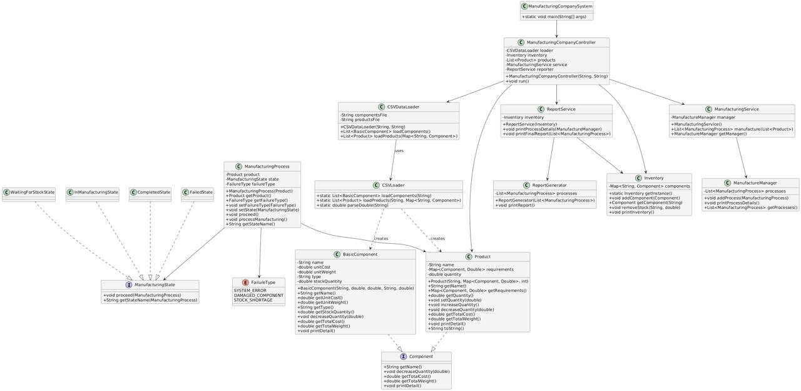

# 🏭 Manufacturing Company System

[](https://www.oracle.com/java/)
[](https://en.wikipedia.org/wiki/Software_design_pattern)
[](https://en.wikipedia.org/wiki/GRASP_(object-oriented_design))

## 📋 Project Overview

This system simulates a manufacturing company's production process, implementing advanced object-oriented design patterns and principles. The system manages the manufacturing of various products composed of raw materials, paints, and hardware components while tracking their states throughout the production pipeline.

### 🎯 Key Features

- **Component hierarchy management** using the Composite pattern
- **State-based manufacturing workflow** using the State pattern
- **Detailed manufacturing reporting**
- **Inventory and stock management**
- **Error handling for manufacturing failures**

## 🏗️ System Architecture

### 🧩 Design Patterns Implemented

#### Composite Pattern

The Composite pattern allows treating individual components and compositions of components uniformly:

```
    Component
    ├── RawMaterial
    ├── Paint
    ├── Hardware
    └── Product (composite, contains other components)
```

All components share common operations like cost calculation, weight determination, and inventory checking, regardless of whether they're simple items (like screws) or complex products (like tables).

#### State Pattern

The manufacturing process transitions through various states:

```
    ┌───────────────────┐      ┌─────────────────┐
    │ WaitingForStock   │─────▶│ InManufacturing │
    └───────────────────┘      └────────┬────────┘
             │                          │
             │                          │
             ▼                          ▼
      ┌─────────────┐           ┌─────────────┐
      │    Failed   │◀──────────│  Completed  │
      └─────────────┘           └─────────────┘
```

- **WaitingForStock**: Initial state, waiting for component availability
- **InManufacturing**: Components being assembled into final product
- **Completed**: Manufacturing successfully finished
- **Failed**: Manufacturing halted due to errors (system error, damaged component, or stock shortage)

### 🔍 GRASP Principles Applied

- **Information Expert**: Components know their own costs and weights
- **Creator**: Factory classes create appropriate component instances
- **Controller**: ManufacturingSystem orchestrates the production process
- **Low Coupling**: Components interact through well-defined interfaces
- **High Cohesion**: Classes have focused responsibilities

## 📊 Data Model

The system processes data from two primary sources:
- `components.csv`: Lists raw materials, paints, and hardware with properties
- `products.csv`: Defines products, their component compositions, and manufacturing quantities

## 🚀 Getting Started

### Prerequisites

- Java Development Kit (JDK) 17 or higher
- Git (for cloning the repository)

### ⬇️ Installation

1. Clone the repository
   ```bash
   git clone https://github.com/yourusername/manufacturing-system.git
   cd manufacturing-system
   ```

2. Ensure your CSV files are in the correct location
   ```
   manufacturing-system/
   ├── src/
   ├── components.csv
   ├── products.csv
   └── ...
   ```

### ▶️ Running the Application

#### Using an IDE (IntelliJ IDEA, Eclipse, VS Code)

1. Open the project in your preferred IDE
2. Locate and run the `Main.java` file

#### Using Command Line

1. Compile the Java code
   ```bash
   javac -d bin src/com/manufacturing/*.java
   ```

2. Run the application
   ```bash
   java -cp bin com.manufacturing.Main
   ```

## 📝 Output

The application produces detailed output including:

- Component loading status
- Manufacturing state transitions for each product
- Final manufacturing report showing:
  - ✅ Successfully manufactured products with cost and weight
  - ❌ Products that failed due to system errors
  - 🔧 Products that failed due to damaged components
  - 📦 Products that failed due to stock shortages

## 📋 Class Diagram


## 📚 Design Documentation

This project follows a structured object-oriented design approach:

### Component Hierarchy

The base `Component` class defines common operations, while specialized subclasses implement specific behaviors:

- `RawMaterial`: Basic building materials
- `Paint`: Finishing materials
- `Hardware`: Assembly components
- `Product`: Composite component containing other components

### Manufacturing Process

The `ManufacturingSystem` coordinates the manufacturing process by:

1. Loading component data from CSV files
2. Creating an initial inventory
3. Processing manufacturing requests
4. Updating inventory as manufacturing progresses
5. Generating a final manufacturing report

### Manufacturing States

Each manufacturing attempt progresses through states that encapsulate behavior:

- **WaitingForStock**: Validates component availability
- **InManufacturing**: Processes the assembly (with random success/failure)
- **Completed**: Updates inventory with newly created product
- **Failed**: Records failure reasons (stock shortage, system error, damaged component)

## 📜 License

This project is licensed under the MIT License - see the LICENSE file for details.

## 👥 Contributors

- [Mehmet Anıl Cömert](https://github.com/MehmetAnilcomert)
- [Atahan Serhat İşbakan](https://github.com/ModestSerhat)
- [Tural Karimli](https://github.com/TuralK)

---

*This project was developed for CENG431 - Building Software Systems course.*
